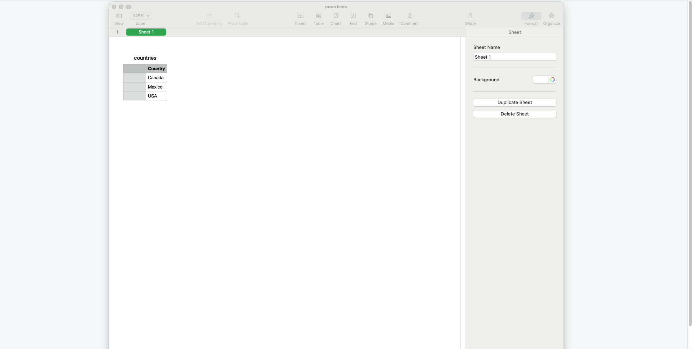

# Rich: Add columns to your CSVs

**Rich** is a lightweight, client-side tool for enriching CSV files using OpenAI’s API. With this tool, you can securely enter your API key (which is stored only in your browser), upload a CSV file, and describe the new columns you’d like to generate. For each row in your file, Rich sends only the necessary data to OpenAI and writes the model’s response to your new columns. Everything except the API call happens locally in your browser, keeping your data safe and private. After enrichment, you can instantly download the updated CSV file.

Below is a screenshot of the tool in action:

